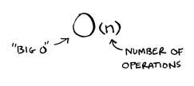

# Grokking Algorithms - Aditya Y. Bhargava

## Introduction
An *algorithm* is a set of instructions for doing a **(specific)** task. Every piece of code could be called an algorithm.

### Binary Search
Binary search is an alogrithms; its input is a sorted list of elements.
if an elment you're looking for is in the list, binary search returh the postion where it's located, otherwise, binary search returns `null`

Suppose you're searching for a person in the phone book. Their name start with *K*. You could start at  the begining and keep flipping pages until get to the *K*s. But you're more likely to start at a page in the middle, because you know the *K*s are going to be near the middle of the phone book.

Or suppose you're searching for a word in dictionay, and it starts with *O*. Again you'll start near the middle.

This is a search problem. And all these cases use the same algorithm to solve the problem: *Binary search*

---

##### How binary search work
I'm thinking of a set of number between 1 to 100.
| 1   | 2   | 3    | 4    | 5    |  ...   | 100 |
| --- | --- | --- | --- | --- | --- | --- |

you have ti try to guess my number in the fewes tries possible.
With every guess, I'll tell you if your guess is too low, too high, or correct.
suppose you start guessing like this: 1,2,3, ... Here's how it would go. it's simple search ( stupid search) in every search you're eliminating only one number. if my number was 99, it could take you 99 guesses to got there!

###### A better way to search
Here's a better technique. Start with *50*
with this trick you can eliminate half of the numbers!
suppose a number is higher than 50
your next guess should be *75* and go on!
with binary search, you guess the middle number and eliminate half the remaining numbers every time. that's it. whatever number i'm thinkning of, you can guess in a maximum of 7 steps! - because you eliminate so many numbers with every guess!

in general, for any list of *n*, binary search will take `log(n)`  steps to run in the worst case, whereas the *stupid search* will taske n steps.


>Binary search only works when your list is in sorted order! for example. the names in a phone book are sorted in aphabetical order, so you can use binary search to look for a name.


```typescript
function binarySearch(arr: number[], value: number) {
  let startElementIndex = 0;
  let endElementIndex = arr.length - 1;

  while (startElementIndex <= endElementIndex) {
    let mid = Math.floor((startElementIndex + endElementIndex) / 2);

    if (arr[mid] === value) {
      return mid;
    }

    if (value < arr[mid]) {
      endElementIndex = mid - 1;
    } else {
      startElementIndex = mid + 1;
    }
  }
  return -1;
}
```


### Big O notation - *O(n)*
*Big O* notion is special notation that tells you how fast an algorithm is. *Big O* does'nt tell you the speed in seconds!. *Big O* notation lets yu compare the number of operations!. It tells you how fast the algorithm grows




> *Big O* show a worst-case run time!

#### Some common *Big O* run times
1. *O(log(n))* => Binary search
2. *O(n)* => simple search
3. *O(n \* log(n) )* => quicksort, A fast sorting algorithm
4. *O(n^2)* => selection sort
5. *O(n!)* => A realy slow algorithm


### Summery
1. Algorithm speed isn't measured in secounds, but in growth of the number of operations.
2. Instead, we talk about how quickly the run time of an algorithm increases as the size of the input increases.
3. Run tume of algorithms is expressed in Big O notation.
4. O(log(n)) is faster than O(n), but it gets a lot faster as the list of items you're searching grows.