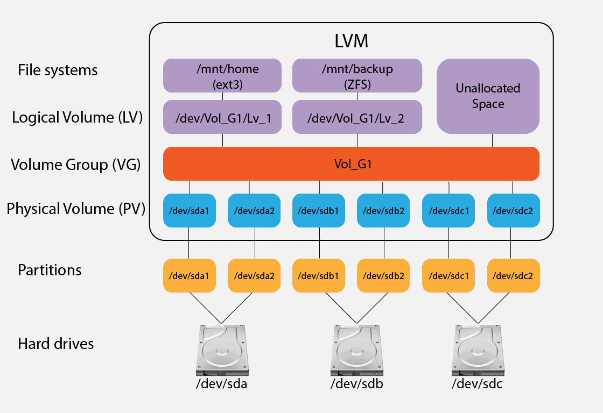

### Storage
- `/` ->  be `LVM`
- `/boot` -> non `LVM`
- `/var` ->  `LVM` 


### LVM - `Logical Volume Manager`



### Print volume groups
```sh
sudo vgs
```


### Scheduling
#### crontab


### iptables
